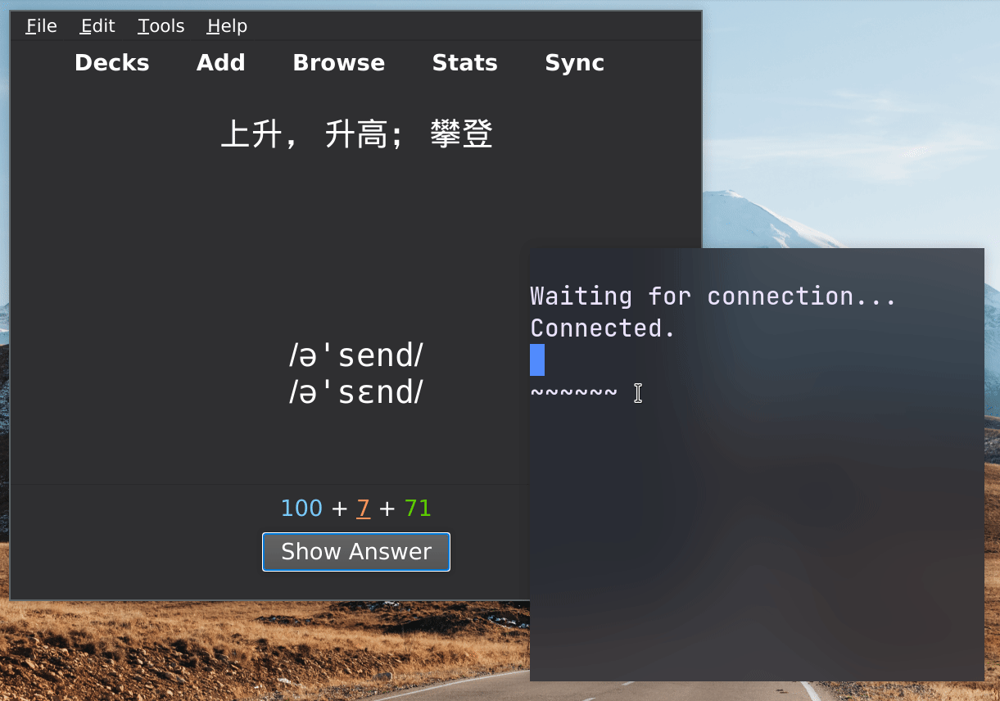

# qwerty
This is an Anki addon for memorizing spellings and practicing typing.

Inspired by [qwerty-learner](https://github.com/Kaiyiwing/qwerty-learner).

Depends on [qwerty](https://github.com/MikeWalrus/qwerty).


background image: Ted.ns, CC BY-SA 4.0 <https://creativecommons.org/licenses/by-sa/4.0>, via Wikimedia Commons

## Quick Start
1. Find your anki [addon
folder](https://addon-docs.ankiweb.net/addon-folders.html), create a new folder and copy everything
there.
2. Build (and optionally install)
[qwerty](https://github.com/MikeWalrus/qwerty).
3. Run Anki. You should see "Enable qwerty" in the "Tools" menu.
4. Either run `qwerty` first before clicking on
"Enable qwerty", or go on to configure the add-on to run it for you.

## Configuration
Open up the configuration file via "Tools->Add-ons->Config".
### `answer_field`
Set this to the name of the field containing what you'll be typing out.

Go to "Tools->Manage Note Types", select your deck,
and click on "Fields" to find out the name.

Defaults to:
```json
"answer_field": "Back"
```
### `command`
Put your
command for running `qwerty` in a terminal in the `"command"` field. It should
be something like this:
```json
"command": "alacritty -e qwerty"
```
 assuming
`alacritty` is your terminal emulator, and it accepts the command it will run
through the `-e` argument.  Change `qwerty` to the location of your `qwerty`
binary if you haven't installed it.

If set correctly, when the add-on complains about `qwerty` not running, the
command will be executed and brings up the terminal if you click on the "Open"
button.

### `thresholds`
Three thresholds of the misspell time for the addon to choose an "ease"
(ie: "Again", "Hard", "Good", "Easy") for you.

For example:
+ `[4, 3, 2]`
    - Again: Misspell more than 4 times.
    - Hard: Misspell less than 4 times but more than twice. (3 times)
    - Good: Less than 3 times but more than once. (2 times)
    - Easy: Once or none.
+ `[2, 2, 1]` is the default because this makes the most sense to me.
    - Again: Misspell more than once.
    - Good: Misspell once.
    - Easy: No misspelling at all.

```json
  "thresholds": [
    2,
    2,
    1
  ]
```